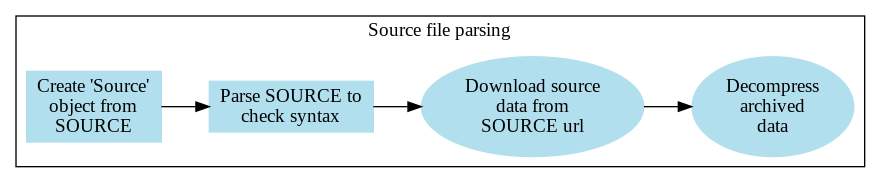
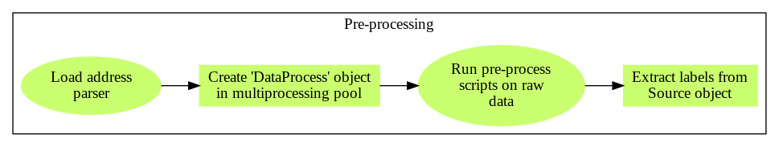
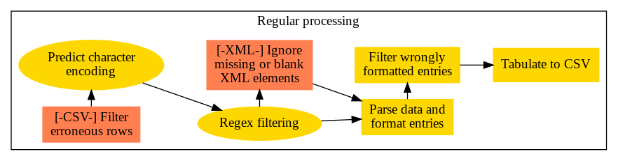
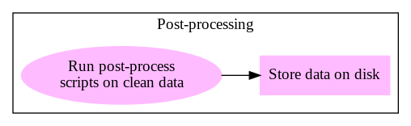

# Introduction

You now have rough idea of what OpenTabulate does (see [README](/README.md)), but perhaps you want to know more. Specifically, it supports

- automated data retrieval
- a systematic way of organizing and retrieving data using *sources files* (inspired by [OpenAddresses](https://openaddress.io)),
- tabulation of data into a standardized CSV format that is suitable for merging and linkage,
- various methods to process data, including address parsing, cleaning and reformatting.

OpenTabulate's API (written in `tabulate.py`) defines several classes and methods, such that when put together form a *processing pipeline*. This simplifies the processing procedure as a sequence of class method invocations. Moreover, this design allows for ease of modification and testing of code. 

The processing pipeline can be described in four stages, each listed and executed in the following order:

1. source file parsing 
2. pre-processing
3. standard processing
4. post-processing

In each stage, a sequence of steps is executed, some of which are optional and can be skipped. This is detailed in the GraphViz digraphs below. Note that the ellipse-shaped nodes represent optional steps and box-shaped nodes are mandatory steps. The initial step in each stage is the left-most node with in-degree zero.

### Summary of OpenTabulate's key features

OpenTabulate supports several features that are useful in stringing together microdata, some of which have are depicted in the diagram above.

+ **Downloading data.** The data can be referenced by a URL to be retrieved, using HTTP or FTP, and can come in a supported format even if compressed or archived.
+ **Tabulation.** Convert data into CSV format with a common set of column names for easy merging.
+ **Pre/post-processing scripts.** If OpenTabulate is missing a feature, you can fill in the gap by customizing and automating processing before and after OpenTabulate's tabulation and cleaning.
+ **Entry filter using regex.** You can tabulate a subset of the data by regular expression filtering. All regular expressions must find a match in their corresponding attributes in order to mark the data entity for processing.
+ **Basic cleaning and error filtering.** Easy to handle residual characters or dirty entries, such as whitespace and unneeded punctuation, is cleaned using regular expressions. Structured information such as province names, postal codes and phone numbers are reformatted if it matches the standard definition, and is otherwise filtered into an "error" file.
+ **Address parsing support (OPTIONAL).** If the `full_addr` tag is used, `libpostal` will be used to parse and split the address into `road`, `house_number`, and so on.

### Getting started

See [Running OpenTabulate](running_opentab.md).
